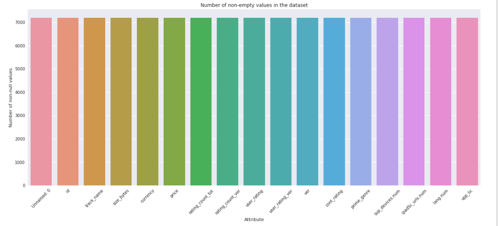
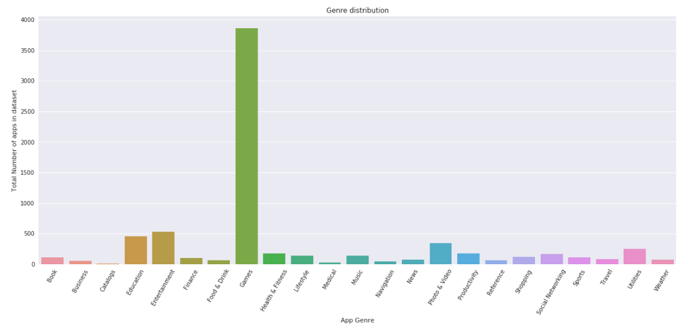
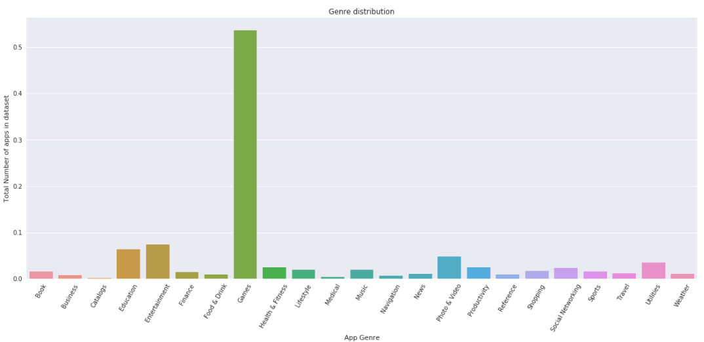
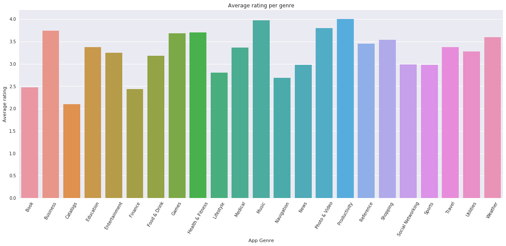

# A comprehensive study of app store user ratings.
## Introduction¶
In this project, we shall pick a dataset, analyse it, draw insight from the data and use it to answer business questions posed. We shall follow the CRISP-DM(Cross Industry Process For Data Mining) Methodology which consists following steps:
+ Business Understanding
+ Data Understanding
+ Data Preparation
+ Modelling
+ Evaluation
+ Deployment.

## Motivation
Big up to everyone who thinks or plans on having an application on an appstore(precisely the apple appstore), and a "bigger up" for those who already have. Putting an app on an app store is a big step. The other step is to get people to download and use the app. 
The number of downloads of an app very much depends on rating, and the number of reviews given for the said app. According to a [suvey](https://www.apptentive.com/blog/2015/05/05/app-store-ratings-reviews-guide/) conducted by [Appentive](https://www.apptentive.com/), a company which uses customer feedback to help compainies increase their app downloads:
+ 92% of the top 100 paid apps have at least a 4 star rating.
+ 98% of the top 100 free apps have at least a 4 star rating

So before asking the team of developers to start working on one of those 'killer' app-ideas that will be next big thing and make millions, it may be wise to look into the appstore and investigate factors affecting user ratings and the different categories or genres of applications.
Is it possible to predict if an app will be highly rated or not? 
What can one do to maximise the chances for his/her app to be highly rated?

My team of 1 has decided to embark on such a task. 
Come with me as we explore the Apple app store to see if we can make some sense out of the ratings and find out information that can help the future app developer. 

We will attemp to answer questions like:
+ Which genre of applications are most common on the app store?
+ What is the most common rating? 
+ Which genre of applications are highly rated and which are least rated?
+ How are prices distributed?
+ How does the number of languages and supported devices affect user rating?
+ Can the rating of the application be predicted from the initial properties of the application(size, supported devices, languages, price….)

### Required Packages
These are the required packages for the project. 
- [Python 3.6.5](https://www.python.org/downloads/release/python-365/).
- [Pandas 0.22.0](https://pandas.pydata.org/pandas-docs/version/0.22/whatsnew.html)
- [seaborn 0.8.1](https://seaborn.pydata.org/)
- [scikit-learn 0.17](http://scikit-learn.org/0.17/preface.html)
- [matplotlib](https://matplotlib.org/)
- [Numpy](http://www.numpy.org/)
- [jupyter](http://jupyter.org/)

### All files
The files contained in this repository are:
+ AppleStore.csv - Our dataset.
+ blog_your_solution.ipynb - Our ipython notebook containing the solution.
+ blog-your-solution.html - Html copy of our solution
+ README.md - Markdownfile summarising the project.

### Plan
The project will evolve in these various stages:
- Download and extract the data from Kaggle.
- Summarize the dataset using Jupyter Notebook
- Check completeness of the dataset.
- Answer the questions posed at the beginning by visualization and machine learning.

### Dataset
The dataset for this project is an Apple iOS app store on [kaggle](https://www.kaggle.com/ramamet4/app-store-apple-data-set-10k-apps/home). The data contains 7197 rows and 16 columns. The columns are as follows:
- "id" : App ID
- "track_name": App Name
- "size_bytes": Size (in Bytes)
- "currency": Currency Type
- "price": Price amount
- "rating_count_tot": User Rating counts (for all version)
- "rating_count_ver": User Rating counts (for current version)
- "user_rating" : Average User Rating value (for all version)
- "user_rating_ver": Average User Rating value (for current version)
- "ver" : Latest version code
- "cont_rating": Content Rating
- "prime_genre": Primary Genre
- "sup_devices.num": Number of supporting devices
- "ipadSc_urls.num": Number of screenshots showed for display
- "lang.num": Number of supported languages
- "vpp_lic": Vpp Device Based Licensing Enabled

### Data Completeness

Looking at the graph of non-empty values, I could conclude that all fields are completely filled. Checking the data types for each column, all the types are correct given the category of data in every column. 

### A summary of Some of Our Findings
#### Question 1: Which genre of applications are most common on the app store?

From the genre distribution bar-chart above, it can be concluded that the games' genre has the highest apps on App Store occupying about 53% of the dataset. 

### Question 2: Which is the most common Rating
For almost all genres, the most common rating was 4.5. The finance genre has 0.0 as the highest rating though.

####  Question 3:  Which genre of applications are highly rated and which are least rated? 

Productivity applications are most highly rated, closely followed by Music applications and Business applications.

#### Question 6: Can an App be predicted to be a highly rated app or a lowly rated app from the initial properties of the application(app size, supported devices, languages, price….)?
To answer this question, a support vector machine classifier is trained on the input fields of the dataset("price", "prime_genre","sup_devices.num","ipadSc_urls.num","lang.num"). The "prime_genre" column which is a text field is converted to categorical values to enable compatibility with Sklearn SVM classifier. The labels (user_ratings) were also converted to categorical values as SVM works only with integer values.
We had an accuracy of 69.9%.

We also tried a linear regression model, and had almost same accuracy. We however stuck with the Support Vector classifier as it's accuracy was slightly higher. 

A more detailed summary can be found in the ipython notebook.
Also, more insights can be gotten from the blog post on [medium]()

## Acknowledgements
+ The dataset for this project was downloaded from kaggle.
+ The picture for the blog post was gotten from [Mobile app daily](https://www.mobileappdaily.com/2018/01/5/ways-to-improve-ios-app-rating-in-app-store)

