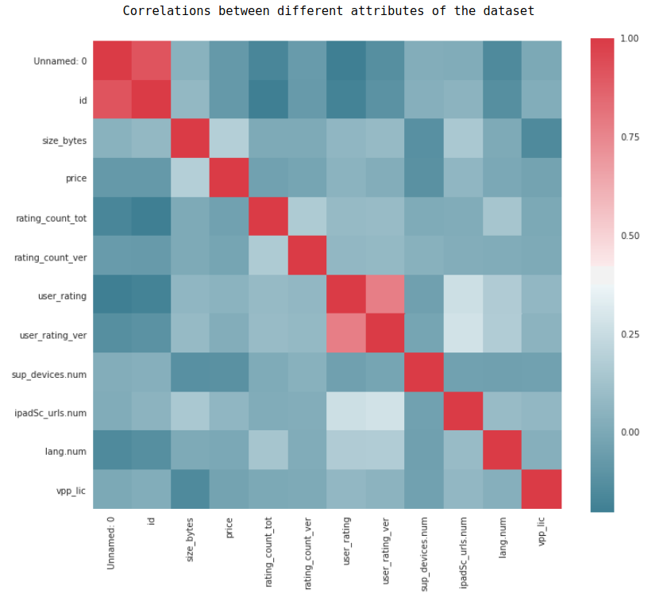
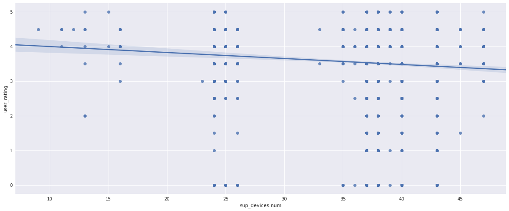

 # A comprehensive study of app store user ratings.
## Business Understanding
This project is centered the understanding of the factors which influence user ratings on Apple app store. The project will address these five questions:
- Which genre of applications is most common on the app store?
- Which genre of applications are highly rated and which are least rated? 
- How do the number of languages and supported devices affect user rating? 
- Can the rating of the application be predicted from the initial properties of the application(size, supported devices, languages, price….)

The project will utilize visualizations like bar-charts to answer the first four questions and the last will utilize supervised learning to determine if ratings could be predicted. 

### Required Packages
These are the required packages for the project. 
- [Python 3.6.5](https://www.python.org/downloads/release/python-365/).
- [Pandas 0.22.0](https://pandas.pydata.org/pandas-docs/version/0.22/whatsnew.html)
- [seaborn 0.8.1](https://seaborn.pydata.org/)
- [scikit-learn 0.17](http://scikit-learn.org/0.17/preface.html)
- [matplotlib](https://matplotlib.org/)
- [Numpy](http://www.numpy.org/)
- [jupyter](http://jupyter.org/)

### Plan
The project will evolve in these various stages:
- Download and extract the data from Kaggle.
- Summarize the dataset using Jupyter Notebook
- Check completeness of the dataset.
- Answer the questions posed at the beginning by visualization and machine learning.

### Dataset
The dataset for this project is an Apple iOS app store on [kaggle](https://www.kaggle.com/ramamet4/app-store-apple-data-set-10k-apps/home). The data contains 7197 rows and 16 columns. The columns are as follows:
- "id" : App ID
- "track_name": App Name
- "size_bytes": Size (in Bytes)
- "currency": Currency Type
- "price": Price amount
- "rating_count_tot": User Rating counts (for all version)
- "rating_count_ver": User Rating counts (for current version)
- "user_rating" : Average User Rating value (for all version)
- "user_rating_ver": Average User Rating value (for current version)
- "ver" : Latest version code
- "cont_rating": Content Rating
- "prime_genre": Primary Genre
- "sup_devices.num": Number of supporting devices
- "ipadSc_urls.num": Number of screenshots showed for display
- "lang.num": Number of supported languages
- "vpp_lic": Vpp Device Based Licensing Enabled

### Data Completeness

Looking at the graph of non-empty values, I could conclude that all fields are completely filled. Checking the data types for each column, all the types are correct given the category of data in every column. 

### Questions
#### Question 1: Which genre of applications are most common on the app store?

From the genre distribution bar-chart above, it can be concluded that the games' genre has the highest apps on App Store occupying about 53% of the dataset. 

####  Question 2:  Which genre of applications are highly rated and which are least rated? 

Productivity applications are most highly rated, closely followed by Music applications and Business applications.

#### Question 3: How do the number of languages and supported devices affect user rating? 
Below is a correlation plot for all the attributes of this dataset. 

Looking closely at the correlation plot, language number has about 0.4 correlation with user rating and supported devices has about 0.25 correlation and both values are low indicating a minimal correlation between the two columns and the user rating. 

Looking at the scatter plot of supported devices against user ratings above, it can be concluded that there is no significant relationship between the number of supported devices and the user rating. The ratings become more uniformly distributed as the number of devices increase. 

A closer look at the scatter plot of the number of languages against user ratings reveals a bit of correlation as the number of languages increase. More ratings are given for many more languages supported. 

### Question 4: Can the rating of the application be predicted from the initial properties of the application(app size, supported devices, languages, price….)?
To answer this question, a support vector machine classifier is trained on the input fields of the dataset("size_bytes","price", "prime_genre","sup_devices.num","ipadSc_urls.num","lang.num","ipadSc_urls.num"). The "prime_genre" column which is a text field is converted to categorical values to enable compatibility with Sklearn SVM classifier. The labels (user_ratings) were also converted to categorical values as SVM works only with integer values. The accuracy matrix was used to evaluate the performance of the model. The best training accuracy obtained was 38.6. The accuracy on the test dataset was 38.4. Given these low accuracies obtained on the dataset, it can be concluded that the ratings of an application on play store cannot be adequately predicted from the input features. There is little correlation between all the input fields and the user ratings. 

